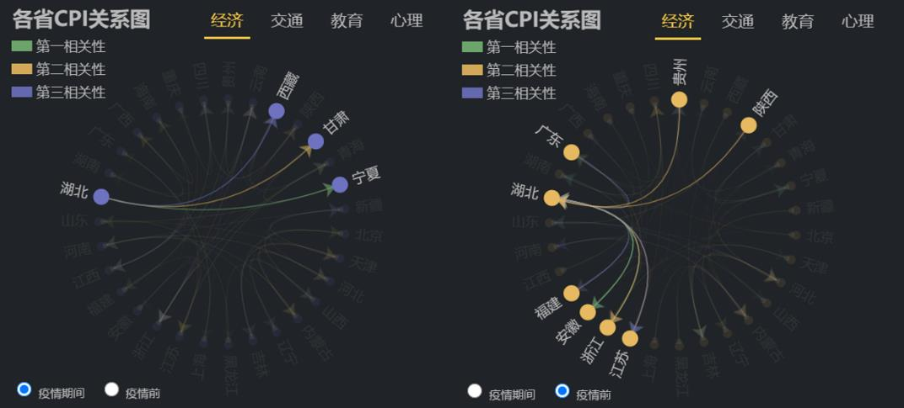
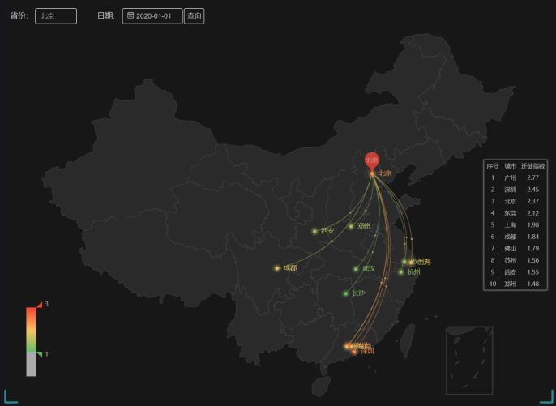
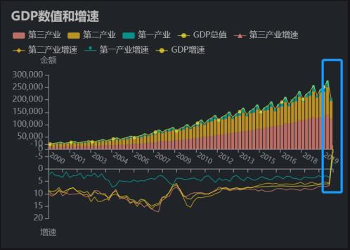

# 设计需求

## 设计背景

​		新型冠状病毒肺炎（COVID-19，简称“新冠肺炎”）疫情肆虐全球多个国家，2020年3月11日，世界卫生组织 (WHO) 正式宣布将新冠肺炎列为全球性大流行病。在全球抗击新型冠状病毒疫情的过程中，产生了前所未有的大规模疫情数据，利用大数据分析技术和方法能够协助发现病毒传染源、监测疫情发展、调配救援物资，从而更好地进行疫情防控工作。可视分析作为大数据分析的重要方法，将数据智能处理、视觉表征和交互分析有机地结合，使机器智能和人类智慧深度融合、优势互补，为疫情防控中的分析、指挥和决策提供有效依据和指南。

## 研究问题

​		新型冠状病毒肺炎对我国经济发展造成了巨大冲击，影响到了人口流动的趋势并且进一步关联到企业复工复产的状态。因此，我们小组利用可视分析技术，充分关联多源数据，来展示疫情走势与人口流动的变化趋势以及经济复工复产的状态。

## 目标用户

1. 关注疫情影响的普通群众；
2. 需要分析及评估疫情影响并制定相关防控措施的政府部门；
3. 需要基于疫情影响做出合适决策，制定相关策略的企业与机构。

## 应用价值

​	    借助疫情走势和人口流动的变化趋势，有助于分析疫情传播模式、比较各地传播差异、检测异常传播事件，制定传播管控策略，再辅以经济复工复产的状态，能够更好地评估疫情对国民经济、企业生产等方方面面带来的影响，防控复工复产困难、物资供需失衡等疫情次生灾害的发生。

# 设计介绍

## 数据

​		新型冠状病毒肺炎疫情（简称新冠疫情）是全球重大突发公共卫生事件，不仅对我国医疗卫生体系提出重大挑战，也对我国经济社会造成了重大冲击。CSMAR在疫情爆发后积极响应科研抗“疫”的理念，秉承为学术界提供一流研究数据的一贯精神，于国内率先推出了新冠疫情与经济研究数据库，助力学者开展经济、金融、管理等领域的新冠疫情相关研究工作。新冠疫情与经济研究数据库收录了疫情基本信息、人口流动、经济影响三部分数据。其中，疫情基本信息包括每日疫情数据、财政补助资金情况、确诊病例逗留地点分布、病患轨迹、医疗救治医院情况；人口流动包括省份及城市的迁入迁出人口比例；经济影响包括宏观经济、股市、上市公司的数据。

​		我们选取了 CSMAR 的全国热门迁入迁出省份表、宏观经济景气指数表和国内主要经济指标环比数据表数据作为数据来源。具体数据条目和主要字段如下所示：

| 数据名称               | 主要字段                                                     | 条目数量 |
| ---------------------- | ------------------------------------------------------------ | -------- |
| 全国热门迁入迁出省份表 | 统计日期、省份代码、省份名称、迁入人口比例、迁出人口比例     | 3565     |
| 宏观经济景气指数表     | 统计期间、预警指数、一致指数、先行指数、滞后指数             | 357      |
| 国内主要经济指标环比   | 统计月度、规模以上工业增加值环比增速(%)、固定资产投资(不含农户)环比增速(%)、社会消费品零售总额环比增速(%) | 12       |

## 设计框架

​		我们小组使用了 D3.js 和 React

​		blablabla

## 可视化流程

# 案例展示

> 模块展示这里最后替换成我们自己的，我先随意打个样子

## 主面板

底下是可以拉动的时间条，上面的数据随之变动。

左上角可以选择迁入or迁出，以及选择省份。选定了省份后，展示前五个迁入的以及前五个迁出的。按照线的粗细表示迁入迁出人数。

右上角右下角是经济指标的柱状图或者别的更好的 idea。

## 模块展示

​		从……可以看出

​		从……可以看出

​		图 3分别展示了疫情前与疫情后与湖北有相似CPI的省份，箭头方向表明关系指向。从图中可知，疫情发生前湖北与安徽、浙江与江苏三个较发达的省份有较强的相似性；疫情发生后与湖北相似的省份变为西藏、甘肃和宁夏，这表明疫情对湖北地区的经济产生较为强烈的冲击。

​		分析疫情地区，本系统发现湖北地区在封城前期的主要迁出地为重庆、南阳、信阳、岳阳等地区，如图所示。且这些主要迁出地区在疫情爆发后均是重灾区。基于此，本系统建议疫情区应加强人员迁出的管控，迁出地也应采取更全面的防范措施对迁入人员进行检测、隔离、跟踪。

​		而对三大产业和国内生产总值(GDP)数值及增速，如图 15所示，国内的GDP数值在2000年至2019年期间一直处于增长状态。在2003年受到非典和2008年国内经济危机、汶川地震的影响，GDP的增速虽然放缓，但GDP依旧保持低速增长的趋势。但是由于此次疫情的影响，在2020年第一季度，三大产业和GDP的增速在20年内首次出现负值，总量出现下降。第二产业因为它的工作性质，无法通过网络代替等原因所受冲击最大，第一产业由于是刚需受冲击最小，第三产业通过产业网络化减少了部分损失相对表现不错。由于全国性的停工停产和严格的出行、复产管制措施，第二产业在第一阶段所受冲击最大，国内部分供应链的暂时断裂，更是加剧的制造业在疫情中所受的冲击。因此，应该积极采取应对措施，在防控疫情的同时，稳定经济发展，防止对经济产生重大影响。